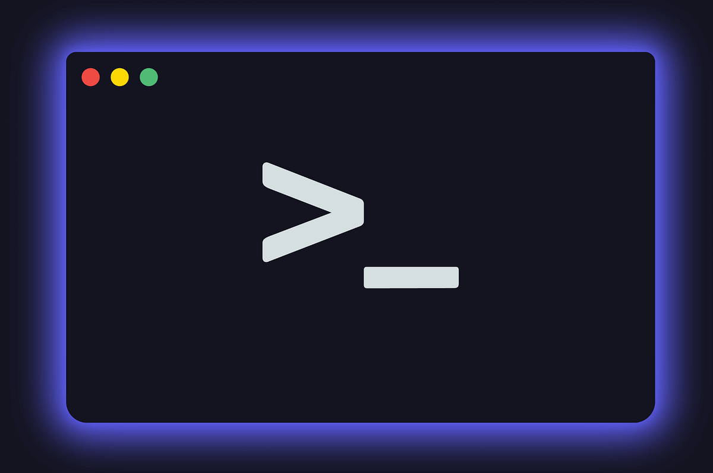

# Descubre la Terminal: Tu Nuevo Superpoder Digital para Windows y Más



## ¿Te da miedo la pantalla negra con letritas? ¡Vamos a cambiar eso!

Si eres de los que solo ha usado Windows y nunca has tocado esa pantalla negra que parece de película de hackers, este curso es para ti. La terminal puede parecer intimidante al principio, pero en realidad es una herramienta superpoderosa que te hará trabajar más rápido y sentirte como un verdadero experto en computación.

Imagina esto: en lugar de hacer clic en diez ventanas diferentes para organizar tus fotos, escribir un comando y ¡listo! Todo se organiza automáticamente. Eso es lo que puedes lograr con la terminal.

## ¿Por qué debería importarte la terminal si ya tengo Windows?

### La cocina vs. el restaurante
Pensemos en las interfaces gráficas (las ventanas, botones y menús que usas normalmente) como comer en un restaurante: todo se ve bonito, pero no ves cómo preparan la comida. La terminal es como tener tu propia cocina: ves exactamente qué pasa con cada ingrediente y puedes crear platillos exactamente como quieres.

### Tu asistente personal digital
¿Alguna vez has tenido que:
- Renombrar 100 fotos una por una?
- Buscar un archivo específico entre miles?
- Hacer la misma tarea repetitiva una y otra vez?

La terminal puede hacer todo esto por ti en segundos, mientras tú tomas un café.

## Beneficios que notarás desde el primer día

### Ahorrarás tiempo real
Con unos pocos comandos, puedes hacer en segundos lo que normalmente te tomaría minutos o incluso horas. Por ejemplo, ¿necesitas buscar todos los documentos de Word modificados la semana pasada? La terminal lo hace instantáneamente.

### Entenderás realmente cómo funciona tu computadora
Dejarás de sentirte frustrado cuando algo no funciona, porque podrás ver exactamente qué está pasando dentro de tu sistema.

### Automatizarás lo aburrido
¿Tareas repetitivas? La terminal las puede programar para que se hagan solas mientras tú haces cosas más importantes.

## Ejemplos super simples para empezar

### Primeros comandos que cualquiera puede usar
En Windows, puedes abrir la terminal presionando Windows + R y escribiendo "cmd", o mejor aún, busca "PowerShell" en el menú de inicio.

Aquí tienes unos comandos útiles:

```
dir
```
Esto te muestra todo lo que hay en la carpeta donde estás, como si abrieras una ventana del explorador de archivos.

```
cd Escritorio
```
Te lleva directamente a tu escritorio. "cd" significa "change directory" (cambiar de carpeta).

```
mkdir MiCarpetaNueva
```
Crea una carpeta nueva llamada "MiCarpetaNueva". "mkdir" significa "make directory" (crear carpeta).

## Cómo la terminal te ayuda a entender tu computadora


Las interfaces gráficas te muestran solo lo básico. La terminal te deja ver todo lo que está pasando detrás de escena. Es como tener visión de rayos X para tu computadora.

### Ejemplo práctico: Encontrar espacio en el disco
¿Alguna vez has visto el mensaje "disco duro casi lleno" y no sabías qué borrar? Con la terminal puedes ver exactamente qué archivos están ocupando más espacio y dónde están escondidos.

## Herramientas útiles que puedes usar desde el primer día

### Para organizar tus archivos
Puedes crear, mover y organizar archivos masivamente sin tocar el mouse.

### Para buscar información
Encontrar archivos perdidos, textos específicos dentro de documentos, o información del sistema.

### Para automatizar tareas
¿Backups? ¿Renombrar fotos? ¿Organizar documentos? Todo se puede automatizar.

## La terminal no es solo para computadoras

### En tu teléfono también existe
¿Sabías que tu Android o iPhone también tienen una terminal? Apps como Termux (Android) te permiten usar comandos hasta en tu móvil.

### En todas las plataformas
Windows, Mac, Linux, incluso en tablets. Donde haya un sistema operativo, hay terminal.

## ¿Y esto realmente me sirve para encontrar trabajo?

### La habilidad secreta
Muchas empresas valoran mucho que sepas usar la terminal, porque demuestra que:
- Entiendes cómo funcionan realmente las computadoras
- Puedes resolver problemas por ti mismo
- Eres eficiente y productivo

### No solo para técnicos
Diseñadores, escritores, investigadores, administradores... cualquiera que use computadora puede beneficiarse de saber usar la terminal.

## Cómo empezar sin frustrarte

### Paso a paso
1. **Abre la terminal** - Solo ábrela y mira, no muerde
2. **Juega con comandos simples** - Como los que te mostré arriba
3. **Comete errores** - Es normal, todos lo hacemos
4. **Pide ayuda** - Internet está lleno de guías para principiantes

### Tu primer logro
Intenta esto:
1. Abre PowerShell (búscalo en el menú de inicio)
2. Escribe `cd Escritorio` y presiona Enter
3. Escribe `mkdir MiPrimeraCarpeta` y presiona Enter
4. ¡Felicidades! Acabas de crear una carpeta en tu escritorio usando comandos

## Tu viaje acaba de comenzar

Aprender terminal es como aprender a andar en bicicleta: al principio da miedo y puedes caerte, pero una vez que aprendes, nunca lo olvidas y te lleva a lugares increíbles.

No necesitas ser un genio de la computación, solo tener curiosidad y paciencia. En este curso, iremos paso a paso, desde cómo abrir la terminal hasta cómo automatizar tus propias tareas.

**La terminal es probablemente la herramienta más poderosa en tu computadora que no sabías que existía.** Te invitamos a descubrirla con nosotros en las siguientes lecciones.

---

**🔍 Anexo:**

**La Historia que Almost Borró a Woody y Buzz**

Durante la producción de la primera película de Toy Story en Pixar, ocurrió un incidente que se ha convertido en una legendaria lección de cuidado con los comandos de terminal.

Uno de los animadores, trabajando en estaciones Unix, accidentalmente ejecutó un comando para eliminar archivos. En segundos, casi **90% de la película** (que representaba meses de trabajo) había desaparecido de los servidores. El pánico se apoderó del estudio cuando se dieron cuenta de que personajes, escenas y animaciones completas se estaban esfumando.

**El Salvamento Milagroso**

Afortunadamente, la directora técnica de Pixar en ese momento, Galyn Susman, tenía un sistema de respaldo automatizado en su computadora personal. Gracias a que había configurado una rutina de backups regular (usando comandos de terminal, por supuesto), pudieron recuperar la mayoría de los archivos perdidos. El incidente retrasó la producción solo un día, pero dejó una lección imborrable: el conocimiento técnico adecuado salva proyectos.

**La Lección para Todos Nosotros**

Este famoso incidente demuestra dos caras de la terminal:
1. **El increíble poder** de realizar cambios masivos instantáneamente
2. **La responsabilidad** que conlleva ese poder

Ningún sistema gráfico te permitiría borrar accidentalmente tantos archivos tan rápido. La terminal te da capacidades sobrehumanas, pero como dijo el Tío Ben de Spider-Man: "Un gran poder conlleva una gran responsabilidad".

---

**💡 Comentario Humorístico: "El trabajador de Pixar: sudo rm -rf /"**

**Explicación del chiste para principiantes:**

Este es un chiste técnico que se vuelve gracioso cuando entiendes lo que significa el comando:

- **`sudo`**: Significa "haz esto con permisos de superusuario" (como ser administrador)
- **`rm`**: Significa "remove" (eliminar)
- **`-rf`**: Flags que significan "recursivo" (todo dentro de carpetas) y "force" (sin preguntar)
- **`/`**: Se refiere al directorio raíz, es decir, ¡TODO el sistema!

En otras palabras: **"Elimina forzadamente todo en la computadora sin preguntar"** 😱

El chiste sugiere (exageradamente) que el empleado de Pixar accidentalmente usó el comando más destructivo posible en Unix/Linux, lo que haría que cualquier experto en terminal se estremezca de horror.

>**⚠️ ADVERTENCIA IMPORTANTE**:
>Nunca ejecutes este comando en tu terminal, incluso por curiosidad. Borraría irreversiblemente todo tu sistema operativo y archivos. ¡Es el equivalente digital de pulsar el botón de autodestrucción!

*¿Listo para dar tu primer paso? En el iguiente paso te guiaremos para instalar y configurar tu terminal para que tengas la mejor experiencia de aprendizaje.*