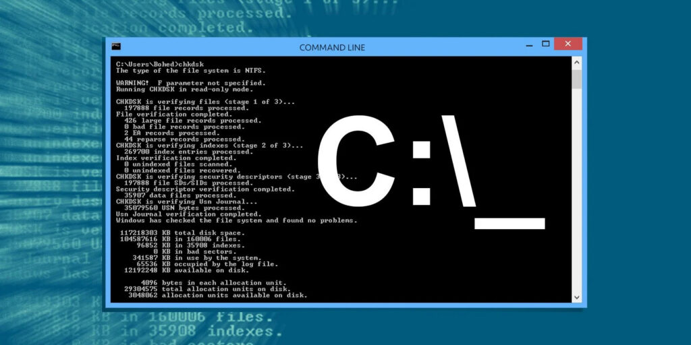

# Tu Guía Definitiva para Entender Qué es una Terminal y Cómo Funciona



## La Terminal: Tu Intérprete Personal con la Computadora

Imagina que llegas a un país donde no hablas el idioma local. Necesitas un traductor para comunicarte, ¿verdad? Así funciona exactamente la terminal: es tu **traductor personal** que convierte tus instrucciones en un lenguaje que la computadora puede entender y ejecutar.

Una terminal es una interfaz de usuario que facilita la comunicación con el sistema operativo mediante comandos específicos. En lugar de hacer clic en iconos y menús, escribes instrucciones precisas que te permiten realizar acciones concretas como crear, copiar o eliminar archivos, administrar procesos y configurar tu sistema exactamente como necesitas.

## El Cerebro Detrás de la Magia: ¿Qué es una Shell?

Detrás de cada terminal hay un programa especial llamado **Shell** (que significa "concha" en inglés). Piensa en la Shell como el intérprete que:

1. **Escucha** los comandos que escribes
2. **Traduce** estas instrucciones a lenguaje máquina
3. **Entrega** las órdenes al sistema operativo
4. **Te muestra** los resultados en pantalla

### Ejemplo de cómo funciona:
```
Tú escribes: "mostrar archivos de la carpeta actual"
La Shell traduce: `ls` (en Linux/Mac) o `dir` (en Windows)
La computadora ejecuta: lista todos tus archivos
Tú ves: el listado completo organizado
```

## ¿Qué Puedes Hacer Realmente con una Terminal?

### Gestión de Archivos (Sin Abrir Ventanas)
```powershell
# Crear una nueva carpeta para tus proyectos
mkdir MisProyectos2024

# Copiar todos los documentos PDF a una ubicación segura
Copy-Item *.pdf D:\Backups\Documentos

# Ver qué hay en tu escritorio sin abrir el explorador
Get-ChildItem Desktop
```

### Tareas Avanzadas al Alcance de tu Teclado
- **Monitorear el rendimiento** de tu computadora en tiempo real
- **Automatizar backups** de tus fotos y documentos importantes
- **Gestionar programas** que se ejecutan al iniciar tu equipo
- **Conectar con otros dispositivos** en tu red doméstica

## Terminales en Todos lados: No Solo para Linux

### Windows tiene Potentes Opciones
**PowerShell**: El shell moderno de Windows, perfecto para:
- Gestionar archivos y configuraciones del sistema
- Automatizar tareas con scripts potentes
- Administrar redes y conexiones

**Bash con WSL**: El estándar de Linux en tu Windows:
- Instala Ubuntu o otras distribuciones directamente
- Usa los mismos comandos que millones de desarrolladores
- Perfecto si quieres aprender habilidades transferibles

### ¿Cuál Elegir para Empezar?
| Característica | PowerShell | Bash (con WSL) |
|----------------|------------|----------------|
| **Facilidad** | ✅ Más fácil para usuarios Windows | ⚠️ Requiere instalación |
| **Potencia** | ✅ Excelente para Windows | ✅ Estándar universal |
| **Recomendación** | **Ideal para empezar** | Perfecto para crecimiento |

## ¿Dónde Encontrar Terminales en tu Vida Diaria?

### En tu Windows de Siempre
1. Presiona **Windows + X** y selecciona "Windows PowerShell"
2. Escribe **"PowerShell"** en el buscador de Windows
3. Presiona **Windows + R** y escribe "powershell"

### En Lugares Inesperados
- **Visual Studio Code**: Presiona `Ctrl + Ñ` para abrir la terminal integrada
- **Tu Teléfono Android**: Apps como Termux llevan la terminal a tu móvil
- **Navegadores Web**: Muchos sitios offeren terminales online para practicar

## La Historia que Enseñó al Mundo por qué la Terminal es Poderosa (y Peligrosa)

**El Incidente de Toy Story que casi Borra una Película**

Durante la producción del primer Toy Story, un animador ejecutó accidentalmente un comando que eliminó meses de trabajo. Afortunadamente, tenían backups y pudieron recuperar casi todo.

**El famoso chiste técnico:**
```bash
sudo rm -rf /
```
- **`sudo`**: "Ejecutar como superusuario" (permisos totales)
- **`rm`**: "remove" (eliminar)
- **`-rf`**: "recursivo y forzado" (sin preguntar)
- **`/`**: "directorio raíz" (¡TODO el sistema!)

**Traducción**: "Elimina irreversiblemente todo en la computadora sin hacer preguntas"

>⚠️ **NUNCA ejecutes este comando**
> 
> Es solo una lección de lo importante que es saber lo que estás haciendo.

## Tu Primera Lección Práctica

**Ejercicio Seguro para Principiantes**:

1. Abre PowerShell (escribe "PowerShell" en el buscador de Windows)
2. Escribe: `cd Desktop` (te lleva a tu escritorio)
3. Escribe: `mkdir MiCarpetaTerminal` (crea una carpeta nueva)
4. Escribe: `Get-ChildItem` (verás tu nueva carpeta en la lista)

¡Felicidades! Acabas de usar la terminal para crear algo real. ¿Viste? No muerde.

## Por Qué Cualquiera Puede (y Debería) Aprender Terminal

### Rompiendo el Mito
"No necesitas ser un genio de la computación. La terminal es para cualquiera que quiera:"
- **Ahorrar tiempo** en tareas repetitivas
- **Entender mejor** cómo funciona su equipo
- **Ganar confianza** con la tecnología

### De Usuario a Usuario Avanzado
Aprender terminal es el puente entre solo usar programas y realmente entender cómo funcionan. Es como pasar de solo conducir un auto a entender cómo funciona el motor.


**Recuerda**: Cada experto en terminal empezó exactamente donde tú estás ahora. La diferencia es que ellos decidieron dar el primer paso.

---

¿Listo para transformar tu relación con la tecnología? En la próxima lección pasaremos de la teoría a la práctica con comandos que usarás todos los días. ¡No te lo pierdas!